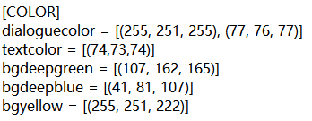
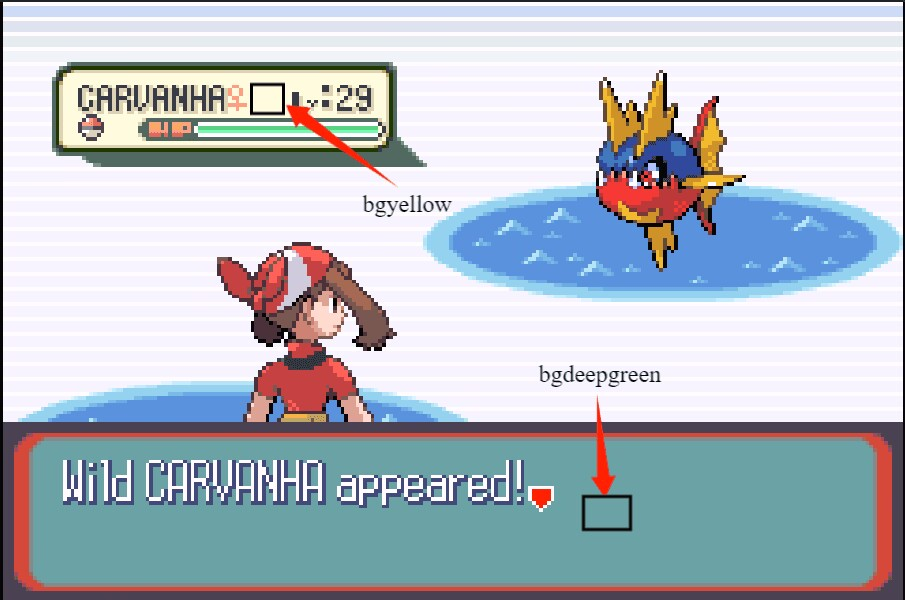
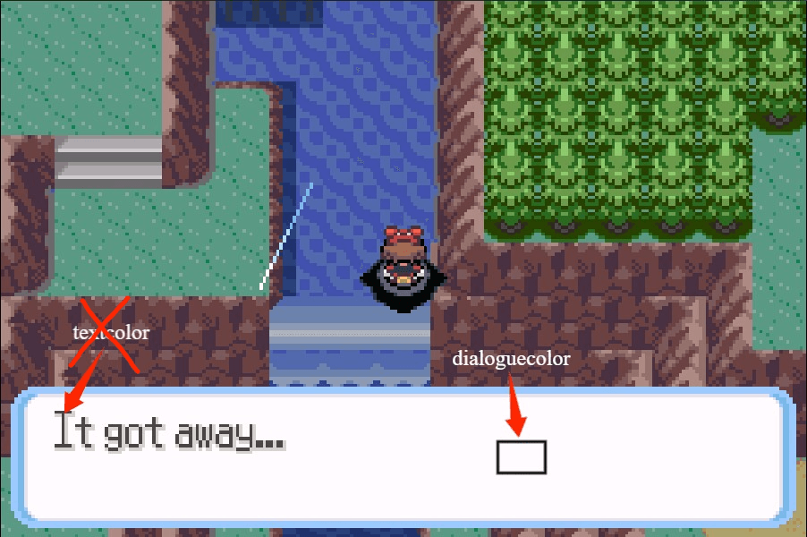
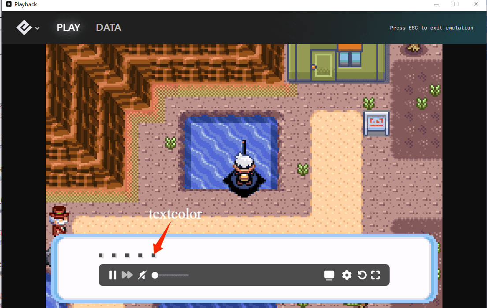

# AutoPoke

> **The emulator bar causes problems because its color value is similar to the text color in Pokémon games. Therefore, it's better to avoid having the emulator bar visible when using AutoPoke, especially during the FISHING function and auto repel. (One approach is to use the PIP mode, i.e., Picture-in-Picture.)**

Auto hunting shiny pokemon using Playback(Epilogue GB operator), writing with Python. Only for Gen3.
宝可梦三代自动化刷闪工具，使用Playback(Epilogue GB operator)。模拟器等也可参考使用。

# How to use?

- **Make sure *TEXT SPEED* in the setting of your game is *Fast*.**
- **In `Emerald` version, make sure *BATTLE SCENE* in the setting of your game is *OFF***
- **Do not minimize the window of Operator when AutoPoke is running.**
- **Your FIRST pokemon should NOT be shiny.**
- **Do not change the window size of Operator *tooooo* large or *tooooo* small.**
- Make player role where you need to encounter PM, and set parameters in `config.ini` file (Optional). Then run `AutoPoke.py` or `AutoPoke.exe`.
- Support sweet scent.
  - You should make sure the pointer of the menu is at **Pokemon**.
  - The last of your pokemon should have learnt sweet scent.
  - Sweet scent should be the first out-battle skill of your last pokemon.

> If your Operator version is lower than `v1.0.0`, download AutoPoke of `v1.1` version.

## Update the config of AutoPoke

> In the latest version, this section is not necessary.

After your first launch, a `config.ini` file will be created in the same directory of AutoPoke. Since I found that the color of Playback differs from PCs, you should update the `Color` config in `config.ini` file, where it looks like this:

Follow the images below to config the color. Attention, here we use RGB value for colors. You can take screenshot and upload to those websites(search them in google) which can give you the RGB you picked.

Here, *dialogcolor* you can only change the first RGB value and leave the second one there. In fact, *bgdeepblue* is similar to *bgdeepgreen* while it's of `FrLg`.

# Already confirmed be of use in

- English version:

|  Confirmed   | RS | E | FrLg |
| :----: | :----: |:----: |:----: |
| Wild Encounter | **Yes** | **Yes** | **Yes** |
| Safari Zone | **Yes** | **Yes** | Not Test |
| Simple Stationary | **Yes** | Not Test | **Yes** |
| Fishing | **Yes** | Not Test | **Yes** |
| Starters | Not Complete | Not Complete | **Yes** |

- Japanese version: Not Test
- Other versions: Not Test

# Update Log

- 2024-12-19
  - Add new features.

- 2024-12-18
  - Refactor code and ui.
  - Automate stop when closing Autopoke.
  - Support starters in `FRLG`.
  - Support Windows notification.

- 2024-11-24
  - Fix bugs.
  - Support fishing in `FRLG`.

- 2024-11-17
  - Fix bugs in Japanese games.
  - Support auto use repel.

- 2024-11-16
  - Support multi-game.

- 2024-11-13
  - Fix sweet scent in `RSE`.
  - Support smoke ball.

- 2024-11-12
  - Support sweet scent.
    - You should make sure the pointer of the menu is at **Pokemon**.
    - The last of your pokemon should have learnt sweet scent.
    - Sweet scent should be the first out-battle skill of your last pokemon.

- 2024-11-10
  - Ready for multi-game.

- 2024-10-22
  - Redone the project.
  - Improve the robustness.

- 2024-05-31
  - Support Stationary in `FrLg`.

- 2024-05-08
  - Support Fishing.

- 2024-04-28
  - You can change the colors for detection in `config.ini` file now.

- 2024-04-22
  - Simplify the size of app.

- 2024-02-29
  - Performance optimization.

- 2024-02-29
  - Support bigger window. (may occur bugs when the window is too large.)
  - Fixed bugs.

- 2024-01-14
  - Add UI.
  - Auto create config.ini file if it does not exist.

- 2024-01-11
  - Move all image detection to memory for processing.
  - Optimized code to reduce meaningless detection.

- 2023-08-28
  - Fixed an issue where additional animation detection and dialogue detection (`E`) may cause errors when there is a menu bar below.
  - Add *run* parameter.

- 2023-08-05
  - Fixed bug for special anime when wildpoke raising.
  - Fixed in `E` when wildpoke, receiving pokenav will interrupt autopoke. (NOT TESTED)
  - Fixed bug when in cave. InCave parameter is no longer needed.

- 2023-08-04
  - Update for Operator version later than `v1.0.0`, renamed to `Playback`.
  - Support extra anime detection for `FrLg`, which only support `RS` in lower version.

- 2023-07-20
  - Stationary function is available now.
  - Optimized codes structure and make all configs in one file.
  - Make the `.exe` file for those can not use python.
  
- 2023-07-08: 
  - Much faster when in safari zone.
  - Auto record encounter counts in `parser.ini`.
  - Support edit keymapping in `parser.ini`.
